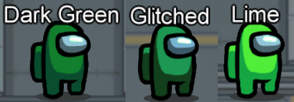
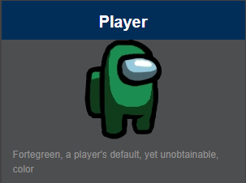
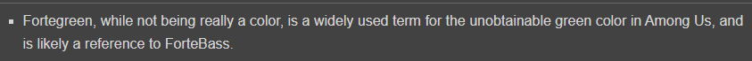

# Among-Us-Editor
### DISCORD: https://koupah.club/aueditor ###  
#### ( https://discord.com/invite/HTm3mwK ) ####    
Join the discord to share your profiles, make suggestions and many other things!  
  
## Download Instructions ##  
### Video Tutorial: https://youtu.be/OS1px12PtGQ ###  
### Requires Java 7 or above https://www.java.com/en/download/ ###  
Download Link: https://github.com/Koupah/Among-Us-Editor/releases  
Download the .jar file by clicking on it, then run it once it's finished downloading  
From there, it's as simple as choosing your settings then applying & running the game  
  
NOTE: You need to relaunch/have your game closed when using this! 
The game only seems to read settings on launch, so use this then launch your game!  

## Videos ##  
1.51 (Latest) by Koupah: https://youtu.be/OS1px12PtGQ  
1.51 by Discord Member: https://youtu.be/7KABvBbP1hM  
1.45 by Koupah: https://youtu.be/rlv_1qFbZFM  
1.0 by Koupah: https://youtu.be/2wRJmS7DKpc  
  
## Secret/Glitched Color (Fortegreen) ##
The secret color is a lighter version of the dark green, in lobbies chat normally won't work, you can't customize your character. People also see your name as "???".  
In game, your dead body will be red, in meetings you'll be red and in chat you'll be red.
Therefore there can be 3 greens and 2 reds, and I believe if multiple people have a different color value above 12, there can be multiple glitched greens (Untested).  

#### This glitched color is referenced in this wiki page https://among-us.fandom.com/wiki/Fortegreen ~~https://among-us.fandom.com/wiki/Player~~ ####
  
  
  

If you upload a video showing or using this please give credit or atleast link this GitHub page!

My Discord: Koupah#5129

## Credits ##  
All Contributors in the discord!
Slymeball: Has helped me bring support to mac/linux via his issues. Thank you.

If you'd like to help w/ something or receive credit, you can contact me on my discord listed above 

## Information for those interested: ##  

There were originally a bunch more commits (50+ lost) but I messed up and forced my whole workspace and it messed everything up  

Custom names that include "\\", ")" or "\[" will result in a "Banned from Room" message and you also cannot include "," in your name as it breaks the file.  
Names longer than 10 characters will also not work in online games, local play lets you make a lobby but I'm not sure if others can join.

Indexes of playerPrefs file (Starting from 1 instead of 0, just -1 in your head)  
1st: Player Name  
2nd: Controls (0 Mouse, 1 Mouse and Keyboard)  
3rd: Preferred color (0-11, 12+ for Fortegreen ~~glitched~~ color)  
4th: Unknown  
5th: Unknown  
6th: Unknown  
7th: Unknown  
8th: Personalized Ads for Mobile (128 On, 129 Off)  
9th: Unknown, probably ad related ~~Unsure but potentially ads On/Off (true/false)~~  
10th: Unknown  
11th: Hat (0 to like 93)  
12th: SFX volume 0-255  
13th: Music volume 0-255  
14th: Apparently GUI scale for mobile (0.5,1.0,1.5)  
15th: Unknown  
16th: Skin (Costume) (0-15)  
17th: Pet (0-10)  
18th: Censor Chat (True/False)  
19th: Language (0-4, 0: English, 1: Spanish, 2: Portuguese, 3: Korean, 4: Russian)  
20th: VSync (True/False)  
